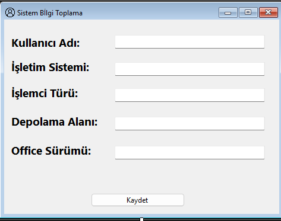

# Sistem Bilgi Toplama Uygulaması

Bu proje, bir Windows Form uygulamasıdır ve kullanıldığı bilgisayarın temel sistem bilgilerini (Kullanıcı Adı, İşletim Sistemi, İşlemci Türü, Depolama Alanı ve Office Sürümü) otomatik olarak toplayıp bir arayüzde görüntüler.




## 🇹🇷 Türkçe Açıklama

### Proje Amacı
Bu uygulama, özellikle teknik destek veya envanter yönetimi gibi amaçlar için, bir bilgisayarın temel donanım ve yazılım bilgilerini hızlı ve kolay bir şekilde toplamayı hedefler. Elde edilen veriler, kullanıcının isteği üzerine daha sonra kullanılmak üzere kaydedilebilir.

### Özellikler

* **Kullanıcı Adı:** Mevcut oturum açmış kullanıcının adını otomatik olarak alır.
* **İşletim Sistemi:** Yüklü olan işletim sisteminin adını ve sürümünü gösterir (Örn: Windows 10 Pro).
* **İşlemci Türü:** Bilgisayardaki işlemcinin model ve temel bilgilerini listeler.
* **Depolama Alanı:** Ana depolama biriminin (C: diski vb.) toplam ve boş alanını gösterir.
* **Office Sürümü:** Bilgisayarda yüklü olan Microsoft Office paketinin sürüm bilgisini toplar.
* **Kaydet Butonu:** Toplanan tüm bilgileri bir dosyaya (örneğin `.txt` veya veritabanına) kaydetme işlevselliği sunar.

### Kullanılan Teknolojiler
* **Dil:** C#
* **Arayüz:** Windows Forms (.NET Framework / .NET Core)
* **Sistem Bilgisi Toplama:** Büyük olasılıkla `System.Management` (WMI) ve/veya Registry (Kayıt Defteri) kütüphaneleri kullanılmıştır.

### Kurulum ve Çalıştırma
1.  Bu repoyu bilgisayarınıza klonlayın veya indirin:
    ```bash
    git clone [https://github.com/Fhewn/Sistem-Bilgi-Toplama.git](https://github.com/Fhewn/Sistem-Bilgi-Toplama.git)
    ```
2.  Visual Studio'yu açın.
3.  Klonladığınız klasördeki `.sln` (Solution) dosyasını açın.
4.  Çözümü derleyin (**Build** > **Build Solution**).
5.  Uygulamayı çalıştırın (**Start** veya `F5`).

---

## 🇬🇧 English Description

### Project Title
System Information Gathering Application

### Project Goal
This application, developed as a Windows Forms application, is designed to automatically collect and display essential system information (Username, Operating System, Processor Type, Storage Space, and Office Version) of the computer it is run on. It is particularly useful for purposes such as technical support or inventory management. The collected data can be saved upon user request for later use.

### Features

* **User Name:** Automatically retrieves the name of the currently logged-in user.
* **Operating System:** Displays the name and version of the installed operating system (e.g., Windows 10 Pro).
* **Processor Type:** Lists the model and basic information of the computer's CPU.
* **Storage Space:** Shows the total and free space of the primary storage drive (e.g., C: drive).
* **Office Version:** Gathers the version information of the installed Microsoft Office suite.
* **Save Button:** Provides functionality to save all collected information to a file (e.g., a `.txt` file or a database).

### Technologies Used
* **Language:** C#
* **Interface:** Windows Forms (.NET Framework / .NET Core)
* **System Info Retrieval:** Most likely utilizes the `System.Management` (WMI) and/or Registry libraries.

### Installation and Running
1.  Clone or download this repository to your computer:
    ```bash
    git clone [https://github.com/Fhewn/Sistem-Bilgi-Toplama.git](https://github.com/Fhewn/Sistem-Bilgi-Toplama.git)
    ```
2.  Open Visual Studio.
3.  Open the `.sln` (Solution) file located in the cloned folder.
4.  Build the solution (**Build** > **Build Solution**).
5.  Run the application (**Start** or `F5`).

***

### 👤 Geliştirici / Developer
[Fhewn](https://github.com/Fhewn)
